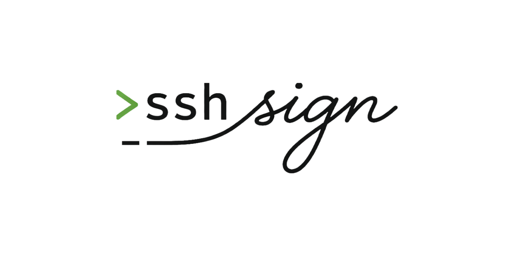

# sshsign

SSH-based signing service for AI agents. No accounts, no passwords, no OAuth. SSH key = identity, scoped authorization = boundaries, immutable receipt = proof.

```
ssh sshsign.dev
```

## What it does

- Agents and developers SSH in, identity detected from their public key
- Create Ed25519 signing keys with scoped authorizations and metadata constraints
- Sign git commits, legal agreements (SAFEs, NDAs), or arbitrary payloads
- Co-sign approval flow: agents act, humans approve with optional handwritten signature
- **Multi-party signing sessions**: two or more parties coordinate a joint signing ceremony through a shareable short code. See [Multi-party signing sessions](#multi-party-signing-sessions) below.
- Negotiation logging with turn enforcement and immutable chain linking
- Every sign, deny, and revoke is logged to an immutable audit trail (immudb)

## Quick start

### Try the TUI

```bash
ssh sshsign.dev
```

### Set up git commit signing (~5 minutes)

1. Install the CLI:

```bash
# Homebrew
brew install agenticpoa/tap/sshsign

# Or Go install
go install github.com/agenticpoa/sshsign/cmd/sshsign@latest
```

2. Pin the host key:

```bash
echo "sshsign.dev ssh-ed25519 AAAAC3NzaC1lZDI1NTE5AAAAIEHD3y2HaBA+KveRWiMN5vigPzDs7s0meo0b/DZcAHne" >> ~/.ssh/known_hosts
```

Fingerprint: `SHA256:07UTOOLZj6oOs+bAZQJ98/40368zyR73DeOevE+8uMw`

3. SSH in and create a signing key:

```bash
ssh sshsign.dev
# Follow the TUI to create a key and set up authorization
# Note your key ID (e.g. ak_7xm3...)
```

4. Configure git:

```bash
git config --global gpg.format ssh
git config --global gpg.ssh.program "sshsign"
git config --global user.signingkey "ak_7xm3..."
```

5. Sign commits:

```bash
git commit -S -m "signed commit"
```

## Programmatic interface

All commands are SSH-based:

```bash
# Create a signing key with constraints
ssh sshsign.dev create-key \
  --scope safe-agreement \
  --tier cosign \
  --require-signature \
  --constraints '{"valuation_cap": {"min": 5000000, "max": 15000000}, "discount_rate": {"min": 0.15}}'

# Sign a payload (cosign returns a pending ID + approval URL)
echo '{"valuation_cap": 8000000}' | ssh sshsign.dev sign \
  --type safe-agreement \
  --key-id ak_xxx \
  --metadata '{"valuation_cap": 8000000, "discount_rate": 0.20}'

# Retrieve the evidence envelope after web approval
ssh sshsign.dev get-envelope --id pnd_xxx

# Log negotiation offers with turn enforcement
ssh sshsign.dev log-offer \
  --negotiation-id neg_xxx \
  --round 0 --from founder --type offer \
  --metadata '{"valuation_cap": 12000000}'

# View negotiation history
ssh sshsign.dev history --negotiation-id neg_xxx

# List keys, revoke, approve, deny
ssh sshsign.dev keys
ssh sshsign.dev revoke --key-id ak_xxx
ssh sshsign.dev approve --id pnd_xxx
ssh sshsign.dev deny --id pnd_xxx
```

## Authorization model

Each signing key has scoped authorizations with typed constraints:

| Constraint type | Example |
|----------------|---------|
| `range` | Valuation cap between $5M and $15M |
| `minimum` | Discount rate at least 15% |
| `maximum` | Penalty no more than $500K |
| `enum` | NDA type: mutual or one-way |
| `required_bool` | Pro-rata rights required |

**Confirmation tiers:**
- **Autonomous** - agent signs immediately
- **Co-sign** - requires human approval before signing
- **Co-sign + handwritten signature** - human approves via web with a drawn signature, sealed into a tamper-evident evidence envelope

## Web approval flow

When an authorization has `require_signature` enabled, the sign response includes an approval URL:

```
https://sshsign.dev/approve/pnd_xxx?token=...
```

The approver opens this in a browser, reviews the agreed terms, draws their handwritten signature, and clicks "Sign & Approve". The signature image is sealed into an evidence envelope alongside the document hash, signer identity, IP, and timestamp. The image exists only inside the sealed envelope.

## Multi-party signing sessions

A **signing session** is a shared, discoverable record that two or more parties read from to coordinate a joint signing ceremony. Use it whenever more than one person has to sign the same document after agreeing on terms — SAFEs, NDAs, employment offers, lending round docs, co-authored agreements, anything.

Sessions are deliberately use-case-agnostic. `sshsign` doesn't know what you're signing; it just provides the coordination primitive:

- One party creates a session and gets a short, shareable code (e.g., `INV-7K3X9`)
- Other parties join using the code; each publishes their APOA public key
- Cancellation, completion, and the full transition timeline are tracked
- The final executed artifact URI is recorded and made auditable through a shareable `/audit/<session_id>` URL that preserves privacy (no authorized-range leakage between parties)

### Commands

```bash
# Create a session (e.g., founder initiating a SAFE negotiation)
ssh sshsign.dev create-session \
  --session-id neg_abc123 \
  --role founder \
  --apoa-pubkey "$(cat founder_apoa.pub)" \
  --party-did did:apoa:alice \
  --metadata-public '{"use_case":"safe","version":1}' \
  --metadata-member '{"company_name":"Acme","expected_counterparty":"Bay Capital"}'
# → Returns a session_code like INV-7K3X9

# Another party joins (e.g., investor)
ssh sshsign.dev join-session \
  --session-code INV-7K3X9 \
  --role investor \
  --apoa-pubkey "$(cat investor_apoa.pub)" \
  --party-did did:apoa:mark

# Fetch session state (members get metadata_member + party list;
# non-members see only metadata_public + status)
ssh sshsign.dev get-session --session-code INV-7K3X9

# Cancel before signing
ssh sshsign.dev cancel-session --session-id neg_abc123

# Post-signing rescission — distinct terminal state
ssh sshsign.dev cancel-session --session-id neg_abc123 --rescind

# Complete (creator-only, idempotent). Issues a view_token for the public audit URL.
ssh sshsign.dev complete-session \
  --session-id neg_abc123 \
  --executed-artifact sshsign://artifact/signed.pdf

# Read the append-only transition log (members only)
ssh sshsign.dev audit-session --session-id neg_abc123
```

### States and lifecycle

```
           join-session
  open ─────────────────► joined
    │                        │
    │                        │ complete-session
    │ cancel-session         ▼
    ▼                    completed ◄── terminal
  canceled ◄── terminal
    ▲
    │ cancel-session --rescind
    │ (after first signature, before completion)
  rescinded_after_sign ◄── terminal

  expired ◄── terminal (24h default TTL on open/joined sessions)
```

Terminal states are immutable — sessions never transition out of them.

### Public audit view

When a session completes, a `view_token` is issued. Anyone holding `/audit/<session_id>?token=<view_token>` can see:

- Agreed lifecycle timeline (create → join → complete with timestamps)
- Party roles, user IDs, DIDs
- SHA-256 fingerprints of each party's APOA public key (integrity-verifiable; keys themselves never exposed)
- Public metadata (the `--metadata-public` field)
- The executed artifact URI

What the public audit view does NOT expose:
- Either party's authorized ranges or constraints (preserves negotiating-position privacy)
- The member-only metadata (company name, expected counterparty, etc.)
- Offer-by-offer history (that's per-party private state)

```bash
# Rotate the view_token if leaked
ssh sshsign.dev share-audit --session-id neg_abc123
```

### Minimal example: two parties counter-sign an NDA

The session primitive isn't specific to SAFEs. Here's a bare-bones NDA flow:

```bash
# Party A creates the session
CODE=$(ssh sshsign.dev create-session \
  --session-id nda_acme_bay_2026 \
  --role party_a \
  --apoa-pubkey "$(cat alice_apoa.pub)" \
  --metadata-public '{"use_case":"nda"}' \
  --metadata-member '{"doc":"Mutual NDA between Acme and Bay Capital"}' \
  | jq -r .session_code)
echo "Share this with Party B: $CODE"

# Party B joins
ssh sshsign.dev join-session \
  --session-code "$CODE" \
  --role party_b \
  --apoa-pubkey "$(cat mark_apoa.pub)"

# Both sign the NDA using regular sign commands;
# the signing_session_id on each pending_signature
# links them back to this session.

# Party A completes once both pendings are approved
ssh sshsign.dev complete-session \
  --session-id nda_acme_bay_2026 \
  --executed-artifact sshsign://artifact/nda_final.pdf
```

A runnable version of this flow lives at `examples/counter-sign-nda.sh`.

### Employment offer negotiation (narrative example)

The session model accommodates richer multi-party flows. Sketch of an employment-offer use case:

1. **Hiring manager** creates a session with role `employer`, attaches metadata like `{"use_case":"employment","position":"Staff Engineer"}`
2. **Candidate** joins as `candidate`. Both sides' APOA tokens bound to *their* authorized negotiation ranges:
   - Candidate's token: `base_salary >= $X`, `equity >= N%`, `start_date <= Y`
   - Employer's token: `base_salary <= $Z`, `equity <= M%`, `non_compete required`
3. The parties' agents exchange offers using the same `log-offer` / `history` machinery that SAFE negotiation uses; sshsign's authorization engine rejects any offer that violates either party's token
4. On agreement, each party signs the executed offer letter; session transitions to `completed`
5. Hiring manager shares the `/audit/<session_id>` URL with HR; the audit shows who signed what when without leaking either side's actual negotiation ceiling or floor

The same pattern applies to lending rounds, vendor contract negotiations, DAO proposal ratification, and any other flow where N parties jointly commit to a shared artifact under individually-authorized constraints.

## Running the server

```bash
export SSHSIGN_KEK_SECRET="$(openssl rand -hex 32)"

# Optional
export SSHSIGN_LISTEN_ADDR=":2222"
export SSHSIGN_DB_PATH="./sshsign.db"
export SSHSIGN_HOST_KEY_PATH="./host_key"
export SSHSIGN_HTTP_ADDR=":8443"
export SSHSIGN_HTTP_DOMAIN="sshsign.dev"

# Optional: immudb for tamper-proof audit trail
export SSHSIGN_IMMUDB_ADDRESS="127.0.0.1"

go run ./cmd/sshsign-server/
```

## Architecture

```
Agent/Developer --SSH--> wish server --HTTP--> web approval
                            |                    (signature
                   +--------+--------+            capture)
                   |                 |
              Bubble Tea TUI   Programmatic CLI
                   |                 |
                   +--------+--------+
                            |
                   Authorization Engine
                   (scopes, typed constraints,
                    hard/soft rules, cosign)
                            |
                  +---------+---------+
                  |         |         |
               Signing   Evidence   Negotiation
               Engine    Envelopes  Offers
               (Ed25519) (sealed)   (turn-enforced)
                  |         |         |
                  +---------+---------+
                            |
                  +---------+---------+
                  |                   |
               SQLite             immudb
           (users, keys,      (immutable
            tokens, offers)    audit trail)
```

## Tech stack

| Component | Technology |
|-----------|-----------|
| Language | Go |
| SSH server | charmbracelet/wish |
| Terminal UI | charmbracelet/bubbletea |
| Web approval | net/http, HTML5 Canvas |
| Signing | crypto/ed25519, SSHSIG format |
| Authorization | Scoped tokens with typed constraints and rules |
| Evidence | Sealed JSON envelopes with SHA-256 binding |
| Audit trail | codenotary/immudb |
| Storage | SQLite (modernc.org/sqlite, CGO-free) |

## Related projects

- [APOA](https://github.com/agenticpoa/apoa) - Agentic Power of Attorney specification
- [negotiate](https://github.com/agenticpoa/negotiate) - AI agent negotiation protocol and SAFE demo

## Troubleshooting

**"Permission denied (publickey)"** - Make sure you have an SSH key (`ssh-add -l`) and that you've connected at least once to register it.

**"Host key verification failed"** - Pin the host key (see quick start step 2), or connect with `ssh -o StrictHostKeyChecking=accept-new sshsign.dev`.

**"unknown key id"** - Run `ssh sshsign.dev keys` to list your keys and check the ID.

**"not your turn"** - Negotiation offers must alternate between parties.

**"this approval requires a handwritten signature"** - The authorization has `require_signature` enabled. Open the approval URL in a browser to draw your signature.

## License

MIT
